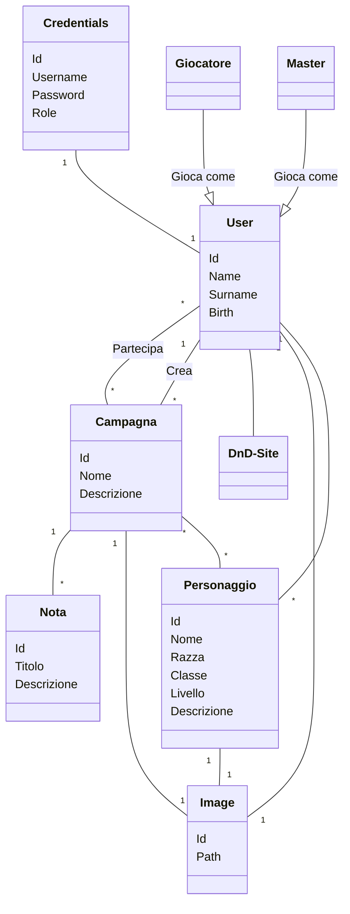

# DnD SIW project
## Portale per organizzare campagne di DnD
Progetto di gruppo svolto per l'esame di "Sistemi Informativi sul Web"

## Authors

## Modello di dominio

```mermaid
classDiagram
  class DnD-Site {

  }

  class Campagna {
    Id
    Nome
    Descrizione
  }

  class Credentials {
    Id
    Username
    Password
    Role
  }

  class Image {
    Id
    Path
  }

  class Nota {
    Id
    Titolo
    Descrizione
  }

  class Personaggio {
    Id
    Nome
    Razza
    Classe
    Livello
    Descrizione
  }

  class User {
    Id
    Name
    Surname
    Birth
  }


  Credentials "1" -- "1" User
  User "*" -- "*" Campagna : Partecipa
  User "1" -- "*" Campagna  : Crea
  User -- DnD-Site
  Campagna "1" -- "*" Nota
  Campagna "1" -- "1" Image
  User "1" -- "1" Image
  Personaggio "1" -- "1" Image
  User "1" -- "*" Personaggio
  Campagna "*" -- "*" Personaggio
  Giocatore --|> User : Gioca come
  Master --|> User : Gioca come
```