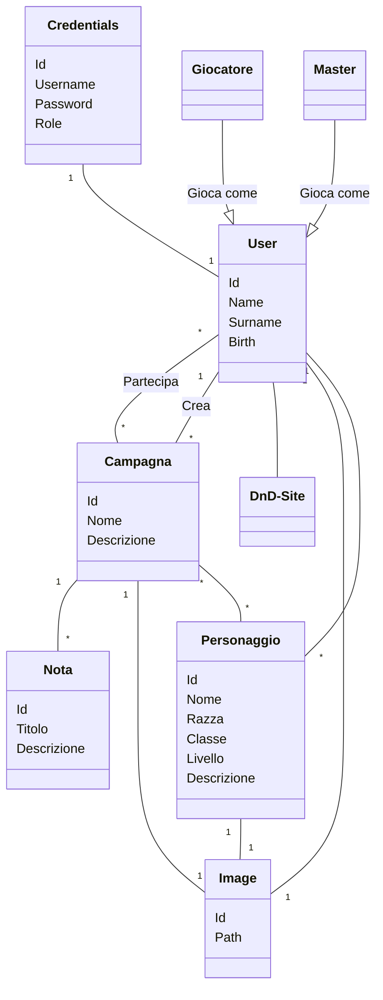

# DnD SIW project
## Portale per organizzare campagne di DnD
Progetto di gruppo svolto per l'esame di "Sistemi Informativi sul Web"

## Authors

## Modello di dominio

# 
# Casi d'uso
**Caso d'uso UC1: Diventa giocatore o master - attore primario: un'utente registrato**
1. L'utente autenticato decide di cambiare il proprio ruolo in master o giocatore per accedere a diverse aree del sistema

**Caso d'uso UC2: Visualizza personaggi - attore primario: un utente con ruolo di giocatore** 
1. L'utente decide di entrare nel sistema come giocatore
2. Il giocatore può visualizzare i suoi personaggio
3. Il giocatore può fare la ricerca tramite nome

**Caso d'uso UC3: Crea nuovo personaggio - attore primario: un utente con ruolo di giocatore**
1. Il giocatore decide di creare un personaggio
2. Il giocatore inserisce nome, razza, classe, livello, una descrizione e una immagine del personaggio (se non è presente nessuna immagine il sistema carica una immagine di default)
3. Il giocatore può annullare la creazione di un personaggio

**Caso d'uso UC4: Modifica personaggio - attore primario: un utente con ruolo di giocatore**
1. Il giocatore decide di modificare un proprio personaggio già creato
2. Il giocatore modifica nome, razza, classe, livello, una descrizione e l'immagine del personaggio
3. Il giocatore può decidere se annullare la modifica del personaggio
4. Il giocatore può decidere di eliminare un proprio personaggio già creato

**Caso d'uso UC5: Visualizza campagne - attore primario: un utente con ruolo di giocatore**
1. Il giocatore può decidere di visualizzare le campagne a cui partecipa
2. Il giocatore può fare la ricerca tramite nome

**Caso d'uso UC6: Partecipa a una campagna - attore primario: un utente con ruolo di giocatore**
1. Il giocatore decide di voler partecipare a una campagna
2. Il giocatore visualizza le campagne già presenti nel database
3. Il giocatore sceglie quella a cui vuole partecipare (può partecipare solo a campagne a cui non ha già partecipato in precedenza)
4. Il giocatore visualizza un elenco di personaggi che ha creato
5. Il giocatore seleziona il personaggio con cui partecipare alla campagna
6. Il giocatore può annullare la partecipazione alla campagna

**Caso d'uso UC7: Visualizza account - attore primario: un utente con ruolo di giocatore**
1. Il giocatore può visualizzare le credenziali e i dati del proprio account

**Caso d'uso UC8: Modifica account - attore primario: un utente con ruolo di giocatore**
1. Il giocatore può modificare nome, cognome, email, data di nascita, username e password
2. Il giocatore può decidere di eliminare il proprio account

**Caso d'uso UC9: Visualizza campagne - attore primario: un utente con ruolo di master**
1. L'utente decide di entrare sul sito come master
2. Il master può visualizzare le campagne che ha creato
3. Può fare la ricerca tramite nome

**Caso d'uso UC10: Crea nuova campagna - attore primario: un utente con ruolo di master**
1. Il master decide di creare una nuova campagna
2. Il master inserisce nome, descrizione e una immagine (considerata come mappa) della campagna (se non è presente nessuna immagine il sistema carica una immagine di default)
3. Il master può annullare la creazione

**Caso d'uso UC11: Modifica campagna - attore primario: un utente con ruolo di master**
1. Il master decide di modificare i dati della campagna 
2. Il master cambia nome, descrizione e immagine della campagna
3. Il master può annullare la modifica 
4. Il master può decidere di eliminare una campagna creata da lui

**Caso d'uso UC12: Aggiungi nuova nota - attore primario: un utente con ruolo di master**
1. Il master decide di aggiungere delle note alla campagna
2. Il master aggiunge titolo e descrizione della nota che vuole aggiungere

**Caso d'uso UC13: Modifica nota - attore primario: un utente con ruolo di master**
1. Il master decide di modificare la nota già creata 
2. Il master modifica nome e descrizione di una nota già presente nella campagna
3. Il master può eliminare la nota

**Caso d'uso UC14: Visualizza account - attore primario: un utente con ruolo di master**
1. Il master può visualizzare le credenziali e i dati del proprio account 

**Caso d'uso UC15: Modifica account - attore primario: un utente con ruolo di master**
1. Il master decide di modificare le credenziali o i dati del proprio account
2. Il master può cambiare nome, cognome, email, data di nascita, username, e password
3. Il master può eliminare il proprio account